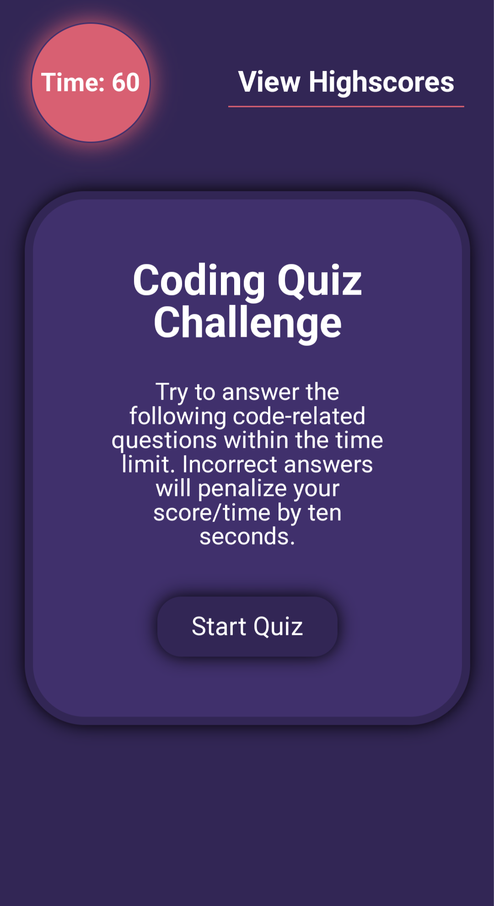

# Timed-Quiz

## Description

During an interview process, it is likely that I'll be asked to take part in assessments that typically consist of multiple choice questions and interactive coding challenges. In order to familiarize myself with this process, this project aims to create a Code Quiz that has dynamically updated HTML and CSS that is powered by JavaScript code.

The finished project will be a timed, multiple-choice question coding quiz that will allow you to save your high score at the end.

## Deployed Link

https://chrisdehaan.github.io/Timed-Quiz/

## Mock-up

### Mobile:

### Website:

## References

- <a href="https://www.w3schools.com/">w3schools</a>
- <a href="https://developer.mozilla.org/en-US/">MDN Web Docs</a>
- <a href="https://stackoverflow.com/questions/49680484/how-to-add-one-event-listener-for-all-buttons">multiple buttons from Aliaksandr Sushkevich</a>

## License

Refer to license in the repo.
